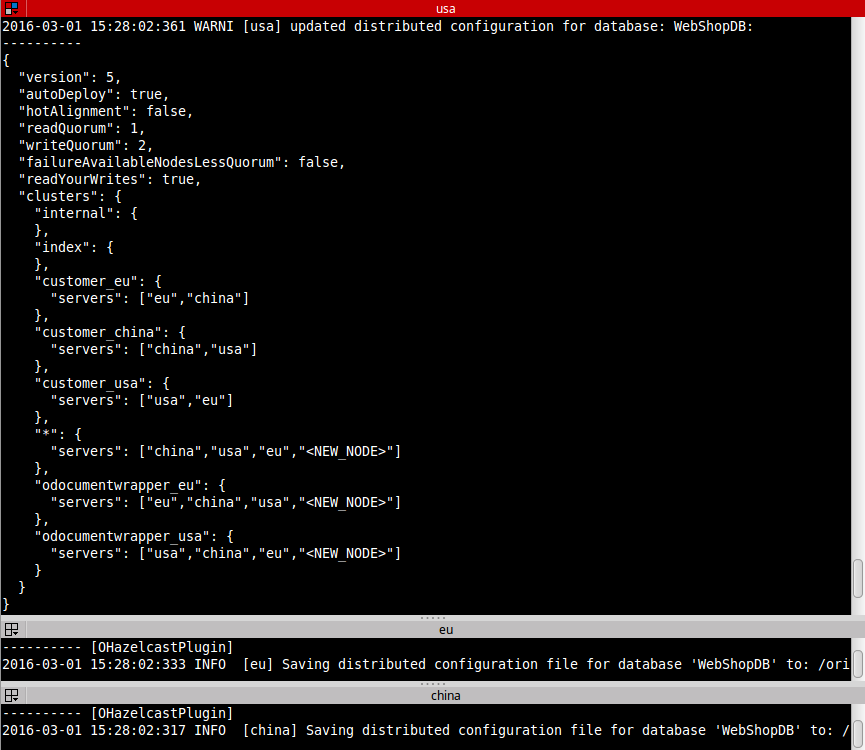

# Fill the Database<a></a>
The output of the docker-container shows the logs from orientDB-server.  
If you have already connected to a DB-server, it should look like:  


The servers use for sharing the config [Hazelcast](https://hazelcast.com/).

###add()
In the previous chapter you learned how to connect/disconnect to the database. Now you will add some customers. By typing `a` for add, a random customer will be added to the default cluster of your connected server:

    and now (c|d|a|r|s|q)?
    a
    How many? (empty for one)
    
    Surname: s163  |  Name: n163  |  Address: city163 str163    <-- added to cluster:default
    
If you are connected to china the default cluster is <TT>customer_china</TT>. The source code for adding is like this:
```java
//ADD A RANDOM CUSTOMER
Customer c = new Customer("s163","n163","str163","city163");
db.save(c);	
```

###show()
To show the existing Customers you have to press `s`:

<pre style="background-color:black; color:white"><code>Select clustername (empty for default):
0: customer_eu
1: customer_usa
2: customer_china
</code></pre>

Now you have two options:

1. Select customers from all clusters
  ```java
    String sSQL = "select * from Customer";
  ```
1. Select customers from specific cluster e.g.: <TT>customer_china</TT>

  ```java
  String sSQL = "select * from cluster:customer_usa";
  ```

Booth variants execute a SQL query and saves the returned customers in a list. Finally the method print the customer-list: 

```java
List&lt;Customer&gt; lstC = db.query(new OSQLSynchQuery&lt;Customer&gt;(sSQL));
for (Customer c: lstC) 
{
    db.detach(c);
    System.out.println(c);
}
```
  
Before printing <tt>c</tt>, a detach is necessary. "*With the detach method all data contained in the document will be copied in the associated object*"[[OrientDB#detach](http://orientdb.com/docs/last/Object-Database.html#detach)]. Without detach the values are <tt>null</tt>.

###remove()
To remove a customer you have to press 'r'. Then a random customer will be removed from your current cluster:

<pre style="background-color:black; color:white"><code>and now (c|d|a|r|s|q)?
r
How many? (empty for one)

Surname: s163  |  Name: n163  |  Address: city163 str163 &lt-- removed from cluster:customer_china
</code></pre>

```java
List&lt;Customer&gt; lstC = db.query(new OSQLSynchQuery&lt;Customer&gt;("select * from cluster:customer_china"));
Customer cR = lstC.get(new Random().nextInt(lstC.size()));
db.delete(cR);
```


