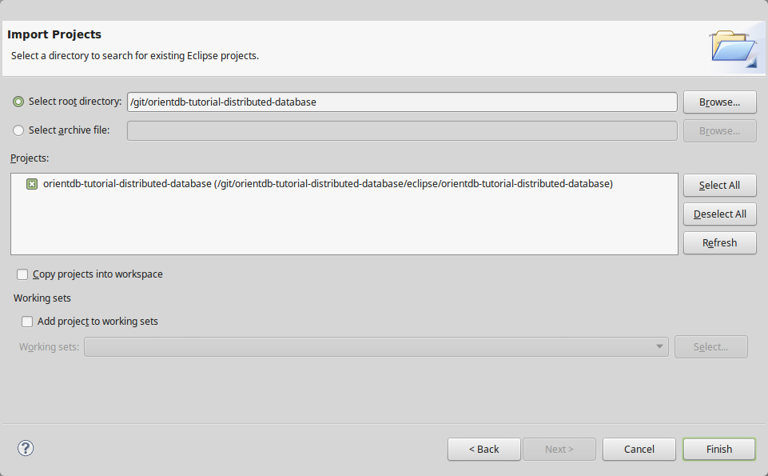

# Set-up Eclipse

In the following chapters we will access and modify the database from Eclipse via Java.
For a better start, the authors of the book have already created an example Java-Project.
Afterwards the methods of the example will be explained. If you understood this example, you can extend or change it and run your own tests.

## Import Project to Eclipse

First of all you have to import the example project in eclipse:

1. Start Eclipse
1. File -> Import -> General -> Existing Projects to Workspace

    Select the "orientdb-tutorial-distributed-database" folder from the downloaded repository.
    
    

After the import, your project explorer should be similar with:

In the main package of the project there are three classes:
    
1. Customer:        defines a simple person with name, address...
2. Main:            entry-point for our program
3. Manager:         various methods for connecting and modifying DB

The customer example is a Java-Object-Project, so we used the Object-API from OrientDB with the corresponding libraries.
http://orientdb.com/download-previous/